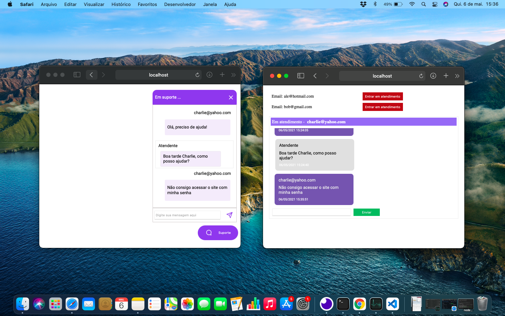

# Chat-NLW-05

<p align="center">
    
</p>

<p align="center">
  <a href="#project">Projeto</a>&nbsp;&nbsp;&nbsp;|&nbsp;&nbsp;&nbsp;
  <a href="#technologies">Tecnologias</a>&nbsp;&nbsp;&nbsp;|&nbsp;&nbsp;&nbsp;
  <a href="#usage">Utilização</a>&nbsp;&nbsp;&nbsp;|&nbsp;&nbsp;&nbsp;
  <a href="#license">Licença</a>
</p>

<p align="center">
   
</p>


## 🚀 Projeto <a name="project"></a>

Implementação de um web chat para comunicação online! 

O escopo desse projeto é o desenvolvimento do backend de um sistema cliente-servidor para troca de mensagens em tempo real. Destaques desse projeto são:

 - SQL tradicional Vs ORM
   - Utilização do [TypeORM](https://typeorm.io/#/) para diminuir a dependência de código SQL puro. No [ORM](https://pt.wikipedia.org/wiki/Mapeamento_objeto-relacional), as tabelas do banco de dados são representadas através de classes e os registros de cada tabela são representados como instâncias das classes correspondentes. Isso torna a programação de queries mais familiar aos programadores acostumados com linguagens orientadas a objeto.
 
 - Protocolo Http Vs WebSocket
   - A biblioteca [Socket.io](https://socket.io) usa o protocolo [WebSocket](https://en.wikipedia.org/wiki/WebSocket) para troca instantânea e bidirecional de mensagens entre cliente e servidor. No http, o conteúdo da página só é atualizado após o retorno de uma requisão feita pelo cliente ao servidor (no caso de um chat: "servidor, existem mensagens novas?"). No WebSocket, os dados são enviados e recebidos independente de requisição enquanto a conexão se mantiver aberta, e aplicações baseadas em React atualizam a parte visual (exibem as novas mensagens) automaticamente, sem o reload da página inteira.
 
 Aplicação desenvolvida durante a **[Next Level Week #5](https://nextlevelweek.com/)**, realizada pela **@Rocketseat** em abril/2021.
 

## 🛠️ Tecnologias <a name="technologies"></a>

Esse projeto foi desenvolvido com as seguintes tecnologias:
- [React](https://reactjs.org)
- [TypeScript](https://www.typescriptlang.org/)
- [Next.js](https://nextjs.org/)
- [Express](https://expressjs.com/pt-br/)
- [TypeORM](https://typeorm.io/#/)
- [Socket.io](https://socket.io)


## 🗂️ Utilização <a name="usage"></a>

### 📥 Baixando o código:

```bash
  # Clone the repository
  $ git clone https://github.com/Alessandro1918/Chat-NLW-05.git
```

### ▶️ Rodando o App:

```sh
  $ cd chat-NLW-05
  
  # Install dependencies.
  $ npm install   # or: yarn
  
  # Start the project:
  $ npm run dev   # or: yarn dev

  # Check out the pages at:
  $ http://localhost:3333/pages/clients   //Client page
  $ http://localhost:3333/pages/admin     //Admin page
  
```
  
  
## 📝 Licença <a name="license"></a>

Esse projeto está sob a licença MIT. Veja o arquivo [LICENSE](LICENSE.md) para mais detalhes.
